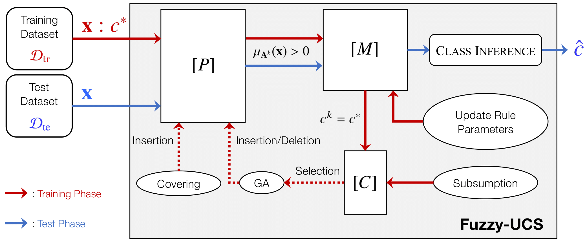
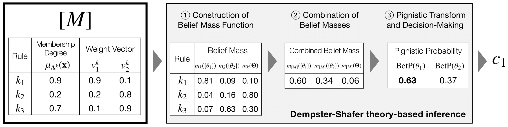
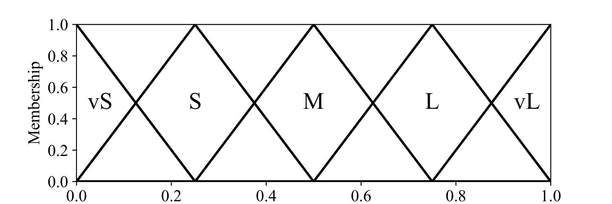

# jUCS: the UCS learning classifier systems in Julia
[](https://doi.org/10.5281/zenodo.14877438)

The jUCS implementation includes UCS <sup><a id="ref1"></a>[[1]](#1)</sup> and Fuzzy-UCS <sup><a id="ref2"></a>[[2]](#2)</sup> codified in Julia, as described in the ACM Transactions on Evolutionary Learning and Optimization (TELO) article:

>Hiroki Shiraishi, Hisao Ishibuchi, and Masaya Nakata. 2025. **A Class Inference Scheme With Dempster-Shafer Theory for Learning Fuzzy-Classifier Systems**. ACM Trans. Evol. Learn. Optim. Just Accepted (February 2025). https://doi.org/10.1145/3717613

In this article, we propose a novel class inference scheme for Learning Fuzzy-Classifier Systems (a.k.a. evolutionary fuzzy rule-based classification systems) based on the Dempster-Shafer Theory of Evidence. Our scheme enhances the handling of uncertainty in classification by calculating belief masses for each class and an *"I don't know"* state, then combining them to infer a class. When applied to the Fuzzy-UCS classifier system, our scheme improves classification performance on 30 real-world datasets compared to conventional voting- and single-winner-based class inference schemes.

## Table of Contents
- [jUCS: the UCS learning classifier systems in Julia](#jucs-the-ucs-learning-classifier-systems-in-julia)
  - [Table of Contents](#table-of-contents)
  - [Overview of jUCS](#overview-of-jucs)
  - [Background: UCS, Fuzzy-UCS, and Theoretical Foundations](#background-ucs-fuzzy-ucs-and-theoretical-foundations)
    - [What are UCS and Fuzzy-UCS?](#what-are-ucs-and-fuzzy-ucs)
    - [Brief Algorithm of Fuzzy-UCS](#brief-algorithm-of-fuzzy-ucs)
    - [Class Inference Schemes for Fuzzy-UCS](#class-inference-schemes-for-fuzzy-ucs)
      - [Voting-based inference (Fuzzy-UCSVOTE)](#voting-based-inference-fuzzy-ucsvote)
      - [Single-winner-based inference (Fuzzy-UCSSWIN)](#single-winner-based-inference-fuzzy-ucsswin)
      - [Dempster-Shafer theory-based inference (Fuzzy-UCSDS)](#dempster-shafer-theory-based-inference-fuzzy-ucsds)
    - [Dempster-Shafer Theory in a Nutshell](#dempster-shafer-theory-in-a-nutshell)
  - [Setup and Usage Guide](#setup-and-usage-guide)
    - [Requirements](#requirements)
    - [Installation](#installation)
    - [Usage](#usage)
      - [Run UCS](#run-ucs)
      - [Run Fuzzy-UCSVOTE](#run-fuzzy-ucsvote)
      - [Run Fuzzy-UCSSWIN](#run-fuzzy-ucsswin)
      - [Run Fuzzy-UCSDS](#run-fuzzy-ucsds)
      - [For Further Details](#for-further-details)
    - [Output Examples](#output-examples)
      - [`summary.csv`](#summarycsv)
      - [`classifier.csv` (Fuzzy-UCS)](#classifiercsv-fuzzy-ucs)
      - [`parameters.csv` (Fuzzy-UCS)](#parameterscsv-fuzzy-ucs)
      - [`time.csv`](#timecsv)
    - [Description of the jUCS Files](#description-of-the-jucs-files)
      - [`./ucs/ucs.jl` and `./fuzzy-ucs/fucs.jl`](#ucsucsjl-and-fuzzy-ucsfucsjl)
      - [`./ucs/classifier.jl` and `./fuzzy-ucs/fclassifier.jl`](#ucsclassifierjl-and-fuzzy-ucsfclassifierjl)
      - [`./ucs/condition.jl` and `./fuzzy-ucs/fcondition.jl`](#ucsconditionjl-and-fuzzy-ucsfconditionjl)
      - [`./ucs/parameters.jl` and `./fuzzy-ucs/fparameters.jl`](#ucsparametersjl-and-fuzzy-ucsfparametersjl)
      - [`./ucs/helper.jl` and `./fuzzy-ucs/fhelper.jl`](#ucshelperjl-and-fuzzy-ucsfhelperjl)
      - [`./ucs/main.jl` and `./fuzzy-ucs/main.jl`](#ucsmainjl-and-fuzzy-ucsmainjl)
      - [`./environment/real_world.jl`](#environmentreal_worldjl)
      - [`./packages.jl`](#packagesjl)
      - [`./dataset`](#dataset)
  - [Reproducing Article Results](#reproducing-article-results)
      - [Run UCS](#run-ucs-1)
      - [Run Fuzzy-UCSVOTE](#run-fuzzy-ucsvote-1)
      - [Run Fuzzy-UCSSWIN](#run-fuzzy-ucsswin-1)
      - [Run Fuzzy-UCSDS](#run-fuzzy-ucsds-1)
  - [Copyright](#copyright)
  - [References](#references)

## Overview of jUCS
jUCS implements:
* UCS with the unordered-bound hyperrectangular representation <sup><a id="ref3"></a>[[3]](#3)</sup>
* Fuzzy-UCS with three class inference schemes:
  * Voting-based inference <sup><a id="ref4"></a>[[4]](#4)</sup> (Fuzzy-UCS<sub>VOTE</sub>)
  * Single-winner-based inference <sup><a id="ref5"></a>[[5]](#5)</sup> (Fuzzy-UCS<sub>SWIN</sub>)
  * Dempster-Shafer theory-based inference (Fuzzy-UCS<sub>DS</sub>)

It allows running experiments on classification datasets to compare the performance of these systems.

## Background: UCS, Fuzzy-UCS, and Theoretical Foundations
### What are UCS and Fuzzy-UCS?
UCS and Fuzzy-UCS are both types of [Learning Classifier Systems](https://en.wikipedia.org/wiki/Learning_classifier_system) (LCSs) <sup><a id="ref6"></a>[[6]](#6)</sup> designed for classification tasks.

UCS (sUpervised Classifier System) is a Michigan-style LCS specifically designed for supervised learning tasks. It evolves a population of rules using an evolutionary algorithm and evaluates their accuracy online. UCS learns from a training dataset or incrementally from a stream of examples, adjusting rule quality estimates and applying a genetic algorithm to create new promising rules.

Fuzzy-UCS (sUpervised Fuzzy-Classifier System) is a Michigan-style Learning Fuzzy-Classifier System (LFCS) <sup><a id="ref1"></a>[[7]](#7)</sup>, an extension of UCS that introduces a linguistic fuzzy representation of rules to improve interpretability while maintaining similar performance and generalization capabilities. It replaces the interval-based representation of UCS with linguistic fuzzy rules, where each input variable is represented by a disjunction of linguistic terms. Fuzzy-UCS aims to evolve a set of maximally general and accurate fuzzy rules that cover the entire input space.

### Brief Algorithm of Fuzzy-UCS



A schematic illustration of Fuzzy-UCS is shown above. The run cycle depends on the type of run: training or test. During the training phase, Fuzzy-UCS searches for an accurate and maximally general ruleset, $[P]$, using a training dataset, $\mathcal{D}_{\rm tr}$. During the test phase, Fuzzy-UCS applies $[P]$ to infer a class for a new unlabeled data point, $\mathbf{x}$.


### Class Inference Schemes for Fuzzy-UCS
#### Voting-based inference (Fuzzy-UCS<sub>VOTE</sub>)
  - Introduced by Bardossy and Duckstein in 1995
  - Aggregates votes from multiple rules
  - Each rule's vote is weighted by its membership degree, fitness, and numerosity
  - The class with the highest total vote is selected

#### Single-winner-based inference (Fuzzy-UCS<sub>SWIN</sub>)
  - Introduced by Ishibuchi et al. in 1999
  - Selects the single rule with the highest product of membership degree and fitness
  - The class predicted by this winning rule is selected

#### Dempster-Shafer theory-based inference (Fuzzy-UCS<sub>DS</sub>)
An example of how the scheme works on a binary classification problem is shown below.



  - Introduced by Shiraishi et al. in 2025
  - Constructs belief mass functions for each rule based on membership degrees and weight vectors
  - Combines belief masses using Dempster's rule of combination
  - Applies pignistic transformation to obtain final class probabilities
  - The class with the highest pignistic probability is selected

### Dempster-Shafer Theory in a Nutshell
The Dempster-Shafer theory was introduced by Shafer <sup><a id="ref8"></a>[[8]](#8)</sup> as a reformation of Dempster's earlier work <sup><a id="ref9"></a>[[9]](#9)</sup>. It offers a mathematical and robust framework for reasoning with uncertainty. Key concepts include:
* Frame of Discernment: A set of mutually exclusive and exhaustive hypotheses
* Belief Mass Function: Assigns degrees of belief to subsets of the frame of discernment
* Dempster's Rule of Combination: Combines evidence from multiple sources
* Pignistic Transformation: Converts belief masses into probabilities for decision-making

The Dempster-Shafer theory allows for representation of both uncertainty and imprecision, making it suitable for complex classification tasks.

## Setup and Usage Guide
### Requirements
* Julia v1.11.1 or higher (download [here](https://julialang.org/downloads/#official_binaries_for_manual_download))
* Packages: ArgParse,
    CategoricalArrays,
    CSV,
    DataFrames,
    MLJ,
    Suppressor

### Installation
Once Julia is installed, you can install the required Julia packages with the following command via the command line interface.
```bash
julia packages.jl
```

### Usage
You can train a UCS/Fuzzy-UCS model using any tabular dataset (e.g., yourfile.csv) for classification via the command line interface. Note that:
- The rightmost column of the CSV file must represent the class label, while all other columns should constitute the input features.
- Class labels must be integers starting from 0 (e.g., 0, 1, 2) for proper processing.
- Any missing values in the dataset should be represented by a question mark (?).
- Ensure that the CSV file does not contain a header row; the data should start from the first line.


Here are examples of how to run the models:

#### Run UCS
```bash
julia ./ucs/main.jl --csv=yourfile.csv
```
#### Run Fuzzy-UCS<sub>VOTE</sub>
```bash
julia ./fuzzy-ucs/main.jl --csv=yourfile.csv --inference=vote
```
#### Run Fuzzy-UCS<sub>SWIN</sub>
```bash
julia ./fuzzy-ucs/main.jl --csv=yourfile.csv --inference=swin
```
#### Run Fuzzy-UCS<sub>DS</sub>
```bash
julia ./fuzzy-ucs/main.jl --csv=yourfile.csv --inference=ds
```

#### For Further Details
```bash
julia ./ucs/main.jl --help
``` 
```bash
julia ./fuzzy-ucs/main.jl --help
```


### Output Examples
Upon completion of the experiment, jUCS generates the following files: 
- [`summary.csv `](#summarycsv)
- [`classifier.csv`](#classifiercsv-fuzzy-ucs)
- [`parameters.csv`](#parameterscsv-fuzzy-ucs)
- [`time.csv`](#timecsv)

#### `summary.csv`
jUCS tracks the following features every epoch:

* Iteration (`Iteration`): The number of training instances used up to the epoch
* Average Training Accuracy (`TrainAcc`): Classification accuracy on the training dataset
* Average Testing Accuracy (`TestAcc`): Classification accuracy on the testing dataset
* Average Training Precision (`TrainPre`)
* Average Testing Precision (`TestPre`)
* Average Training Recall (`TrainRec`)
* Average Testing Recall (`TestRec`)
* Average Training Macro-F1 (`TrainF1`)
* Average Testing Macro-F1 (`TestF1`)
* Average Macropopulation Size (`PopSize`): The number of rules in the population
* Occurrence Rate of the Covering Operation (`%Covering`)
* Number of the Subsumption Operation (`#Subsumption`)

These values are saved as `summary.csv`. An example of log output during the experiment is shown below.

```
       Epoch    Iteration     TrainAcc      TestAcc     TrainPre      TestPre     TrainRec      TestRec      TrainF1       TestF1      PopSize    %Covering #Subsumption
============ ============ ============ ============ ============ ============ ============ ============ ============ ============ ============ ============ ============
           1         5400       43.611       43.500       41.448       40.278       43.497       44.524       36.339       37.464          483        0.003            0
           2        10800       46.333       47.833       44.775       45.873       46.252       48.544       41.260       43.802         1040          0.0            0 
           3        16200       49.333       48.500       48.306       47.916       49.253       49.259       45.862       45.600         1326          0.0            6 
           4        21600       53.426       52.833       53.127       52.812       53.366       53.471       51.819       51.338         1451          0.0            3 
           5        27000       60.537       58.333       61.235       58.933       60.539       58.433       59.923       58.084         1443          0.0           26 
           6        32400       64.981       62.500       66.114       63.920       64.972       62.623       64.962       62.923         1420          0.0           32 
           7        37800       65.593       61.500       67.069       63.576       65.587       61.600       66.023       62.287         1413          0.0           66 
           8        43200       68.815       65.000       71.937       69.081       68.817       65.071       69.571       66.346         1409          0.0           94 
           9        48600       72.037       68.000       72.857       69.698       72.014       68.306       72.162       68.886         1420          0.0           94 
          10        54000       74.833       71.500       74.952       72.224       74.801       71.866       74.794       72.012         1438          0.0          139 
          11        59400       75.833       73.833       76.787       75.251       75.817       73.970       75.889       74.401         1420          0.0          162 
          12        64800       75.944       73.167       78.240       76.438       75.941       73.209       76.511       74.146         1413          0.0          212 
          13        70200       81.796       79.500       82.649       81.393       81.784       79.567       82.017       79.985         1432          0.0          203 
          14        75600       83.278       80.000       84.400       82.458       83.276       80.037       83.463       80.406         1427          0.0          234 
          15        81000       84.944       83.167       85.576       85.121       84.938       83.152       85.081       83.517         1406          0.0          269 
          16        86400       85.759       85.333       85.961       86.111       85.748       85.443       85.820       85.601         1429          0.0          234 
          17        91800       87.315       87.333       87.406       87.887       87.304       87.372       87.339       87.510         1396          0.0          300 
          18        97200       87.037       86.333       87.204       87.017       87.018       86.473       87.041       86.534         1462          0.0          236 
          19       102600       87.981       87.833       88.043       88.333       87.964       88.026       87.966       87.977         1392          0.0          307 
          20       108000       87.944       88.333       87.965       88.711       87.928       88.493       87.915       88.431         1416          0.0          269 
```

#### `classifier.csv` (Fuzzy-UCS)

A $d$ -dimensional fuzzy-rule (a.k.a. fuzzy-classifier) $k$ is represented by the conjunctive normal form (CNF):

```math
{\rm \textbf{IF}} \; x_1 \; \text{is} \; A_1^k \; \text{and} \; \cdot\cdot\cdot\; \text{and} \; x_d \; \text{is} \; A_d^k \; {\rm \textbf{THEN}} \; c^k \; {\rm \textbf{WITH}} \; w^k,
```

where

- Rule-Antecedent (IF part) $\mathbf{A}^k=(A_1^k,..., A_d^k)$: 
  - Determines whether the rule matches a given input
  - $x_i$ is conditioned by $A_i^k$, which is represented by a disjunction of five linguistic terms using triangular-shaped membership functions:
    - very small (vS)
    - small (S)
    - medium (M)
    - large (L)
    - very large (vL)
  
    

  - Note: The set {vS, S, M, L, vL} corresponds to *Don't Care* or #, indicating that any value is acceptable for that attribute
- Rule-Consequent (THEN part) $c^k\in\mathcal{C}$: 
  - Indicates the class that the rule predicts
  - $\mathcal{C}\in\{c_i\}_{i=1}^n$ is a class label set (i.e., for $n$-class classification)
- Rule-Weight (WITH part) $w^k\in[0,1]$:
  - Denotes the confidence or certainty with which the rule predicts the class

Each rule $k$ has the following book-keeping parameters:
- Weight Vector $\mathbf{v}^k\in[0,1]^n$:
  - Indicates the confidence with which the rule predicts each class for a matched input
- Fitness $F^k\in(-1,1]$:
  - Reflects the classification accuracy of the rule
- Experience ${\rm exp}^k\in\mathbb{R}^+_0$:
  - Computes the accumulated contribution of the rule in order to classify training data points
- Correct Matching Vector $\mathbf{cm}^k\in(\mathbb{R}^+_0)^n$:
  - Each element is the summation of the membership degree for training data points from the corresponding class
- Correct Set Size ${\rm cs}^k\in\mathbb{R}^+$:
  - Averages the sizes of the correct sets in which the rule has participated
- Time Stamp ${\rm ts}^k\in\mathbb{N}$:
  - Denotes the time-step of the last execution of the GA to create new rules, where the rule was considered as a candidate to be a parent
- Numerosity ${\rm num}^k\in\mathbb{N}_0$:
  - Indicates the number of rules that have been subsumed

The acquired population is saved as `classifier.csv` as shown below.

|ID|Antecedent|Consequent|Weight|Weight Vector|Fitness|Experience|Correct Matching Vector|Correct Set Size|Time Stamp|Numerosity|
|:----|:----|:----|:----|:----|:----|:----|:----|:----|:----|:----|
|8|{S, M}, {M, L}, {vS, S}, {M, L}|1|0.726 |[0.274, 0.726]|0.453 |16186.94 |[4430.14, 11756.80]|668.67 |61696|1|
|9|{#}, {vS, S}, {#}, {M, L}|1|0.708 |[0.292, 0.708]|0.416 |9771.01 |[2851.79, 6919.22]|683.29 |61650|1|
|12|{#}, {L, vL}, {vS, S, M}, {M, L, vL}|0|0.772 |[0.772, 0.227]|0.544 |22544.29 |[17405.27, 5139.02]|651.77 |61677|1|
|15|{S, M}, {M, L}, {#}, {S, M}|1|0.692 |[0.308, 0.692]|0.384 |8224.34 |[2533.05, 5691.29]|654.17 |61696|2|
|17|{S, M}, {M, L}, {vS, S}, {M, L, vL}|1|0.738 |[0.262, 0.738]|0.475 |17937.25 |[4705.49, 13231.76]|669.21 |61696|1|


#### `parameters.csv` (Fuzzy-UCS)
Fuzzy-UCS has the following hyperparameters:
- $N$ (`N`): Maximum population size
- $F_0$ (`F0`): Fitness threshold
- $\nu$ (`nu`): Fitness exponent
- $\chi$ (`chi`): Crossover probability
- $p_{\rm mut}$ (`mu`): Mutation probability
- $\delta$ (`delta`): Fraction of mean fitness for rule deletion
- $\theta_{\rm GA}$ (`theta_GA`): Time threshold for GA application in a correct set
- $\theta_{\rm del}$ (`theta_del`): Experience threshold for rule deletion
- $\theta_{\rm sub}$ (`theta_sub`): Experience threshold for subsumption
- $\theta_{\rm exploit}$ (`theta_exploit`): Experience threshold for class inference
- $\tau$ (`tau`): Tournament size
- $P_\\#$ (`P_hash`): Probability of *Don't Care* symbol in covering
- $doCorrectSetSubsumption$ (`doCSSubsumption`): Whether correct set subsumption is performed
- $doGASubsumption$ (`doGASubsumption`): Whether GA subsumption is performed


The used hyperparameter values are saved as `parameters.csv` as shown below.
|Parameter|Value|
|:----|:---:|
|N|2000|
|F0|0.99|
|nu|1|
|chi|0.8|
|mu|0.04|
|delta|0.1|
|theta_GA|50|
|theta_del|50|
|theta_sub|50|
|theta_exploit|10|
|tau|0.4|
|P_hash|0.33|
|doGASubsumption|TRUE|
|doCSSubsumption|TRUE|


#### `time.csv`
The runtime (sec.) is saved as `time.csv` as shown below.
```
65.804
```

### Description of the jUCS Files
#### `./ucs/ucs.jl` and `./fuzzy-ucs/fucs.jl`
These files implement the core components of the UCS and Fuzzy-UCS algorithms, respectively. They include:
- The main UCS/Fuzzy-UCS structure
- Functions for generating match and correct sets
- Methods for updating classifier parameters
- Procedures for running the genetic algorithm
- Routines for handling population management

#### `./ucs/classifier.jl` and `./fuzzy-ucs/fclassifier.jl`
These files define the Classifier/FClassifier struct and associated methods for UCS/Fuzzy-UCS. They include:
-  Constructor for creating new Classifiers/FClassifiers
-  Methods for matching Classifiers/FClassifiers to input states
-  Functions for modifying Classifiers/FClassifiers through crossover and mutation
-  Comparison operations to check generality and equality between Classifiers/FClassifiers
  
#### `./ucs/condition.jl` and `./fuzzy-ucs/fcondition.jl`
These files implement the Unordered-Bound Representation (UBR) / the Conjunctive Normal Form (CNF) for classifier conditions in UCS and Fuzzy-UCS, respectively. They include:
* A struct definition for UBR/CNF objects
* Functions for
  * Getting lower and upper bounds of UBR intervals
  * Getting a CNF membership degree against a given input
* Methods for comparing equality between UBR/CNF objects
* Initialization functions for creating new UBR/CNF objects

#### `./ucs/parameters.jl` and `./fuzzy-ucs/fparameters.jl`
These files define the hyperparameters for UCS and Fuzzy-UCS, respectively. They include:
-  A mutable struct called Parameters that encapsulates all hyperparameters for the algorithm
-  A constructor function to initialize the Parameters struct from command-line arguments
-  Definitions for key algorithm parameters such as population size, mutation probability, and various thresholds

#### `./ucs/helper.jl` and `./fuzzy-ucs/fhelper.jl`
These files implement helper functions for UCS and Fuzzy-UCS, respectively. They include:
-  Methods for data output and management
-  Functions for generating classifier lists
-  Routines for creating parameter lists
-  Various performance evaluation functions
-  Inference functions for classification tasks

#### `./ucs/main.jl` and `./fuzzy-ucs/main.jl`
These files implement the main execution logic for the UCS and Fuzzy-UCS algorithms, respectively. They include:
-  Command-line argument parsing for experiment configuration
-  Setup for single or multiple dataset experiments
-  Implementation of training and testing phases
-  Result output and data logging functionality

#### `./environment/real_world.jl`
This file implements an Environment struct and associated functions for handling real-world classification problems. It includes:
* Functions for loading and preprocessing data from CSV files
* Methods for data normalization and shuffling
* Helper functions for managing dataset properties and statistics

#### `./packages.jl`
This file adds a list of required package dependencies to the project using the Pkg module.

#### `./dataset`
This folder contains:
- 30 datasets used in the main article
- 7 additional datasets used in the appendix

## Reproducing Article Results
To reproduce the results from the article:
#### Run UCS
```bash
julia ./ucs/main.jl --all=true
```
#### Run Fuzzy-UCS<sub>VOTE</sub>
```bash
julia ./fuzzy-ucs/main.jl --all=true --inference=vote 
```
#### Run Fuzzy-UCS<sub>SWIN</sub>
```bash
julia ./fuzzy-ucs/main.jl --all=true --inference=swin 
```
#### Run Fuzzy-UCS<sub>DS</sub>
```bash
julia ./fuzzy-ucs/main.jl --all=true --inference=ds 
``` 


These codes will run experiments on the 30 datasets used in the main article and the 7 datasets used in the appendix, and output results.

## Copyright

The copyright of jUCS belongs to the authors in the [Evolutionary Intelligence Research Group](http://www.nkt.ynu.ac.jp/en/) (Nakata Lab) at Yokohama National University, Japan. You are free to use this code for research purposes. In such cases, we kindly request that you cite the following article:

>Hiroki Shiraishi, Hisao Ishibuchi, and Masaya Nakata. 2025. **A Class Inference Scheme With Dempster-Shafer Theory for Learning Fuzzy-Classifier Systems**. ACM Trans. Evol. Learn. Optim. Just Accepted (February 2025). https://doi.org/10.1145/3717613

```bibtex
@article{shiraishi2025class,
author = {Shiraishi, Hiroki and Ishibuchi, Hisao and Nakata, Masaya},
title = {A Class Inference Scheme With Dempster-Shafer Theory for Learning Fuzzy-Classifier Systems},
year = {2025},
publisher = {Association for Computing Machinery},
address = {New York, NY, USA},
doi = {10.1145/3717613},
note = {Just Accepted},
journal = {ACM Trans. Evol. Learn. Optim.},
month = feb
}
```


## References
<a id="1"></a>
[1] Ester Bernadó-Mansilla and Josep M. Garrell-Guiu. "**Accuracy-based learning classifier systems: models, analysis and applications to classification tasks**." Evolutionary Computation 11.3 (2003): 209-238. https://doi.org/10.1162/106365603322365289 [[↑]](#ref1)  

<a id="2"></a>
[2] Albert Orriols-Puig, Jorge Casillas, and Ester Bernadó-Mansilla. "**Fuzzy-UCS: a Michigan-style learning fuzzy-classifier system for supervised learning**." IEEE Transactions on Evolutionary Computation 13.2 (2008): 260-283. https://doi.org/10.1109/TEVC.2008.925144 [[↑]](#ref2)   

<a id="3"></a>
[3] Christopher Stone and Larry Bull. "**For real! XCS with continuous-valued inputs**." Evolutionary Computation 11.3 (2003): 299-336. https://doi.org/10.1162/106365603322365315 [[↑]](#ref3)  

<a id="4"></a>
[4] Andras Bardossy and Lucien Duckstein. **Fuzzy rule-based modeling with applications to geophysical, biological, and engineering systems**. CRC press, 1995. https://doi.org/10.1201/9780138755133 [[↑]](#ref4)  

<a id="5"></a>
[5] Hisao Ishibuchi, Tomoharu Nakashima, and Tadahiko Murata. "**Performance evaluation of fuzzy classifier systems for multidimensional pattern classification problems**." IEEE Transactions on Systems, Man, and Cybernetics, Part B (Cybernetics) 29.5 (1999): 601-618. https://doi.org/10.1109/3477.790443 [[↑]](#ref5)  

<a id="6"></a>
[6] Ryan J. Urbanowicz and Will N. Browne. **Introduction to learning classifier systems**. Springer, 2017. https://books.google.co.jp/books?id=C6QxDwAAQBAJ [[↑]](#ref6) 

<a id="7"></a> 
[7] Manuel Valenzuela-Rendón. "**The fuzzy classifier system: Motivations and first results**." Parallel Problem Solving from Nature: 1st Workshop, PPSN I Dortmund, FRG, October 1–3, 1990 Proceedings 1. Springer Berlin Heidelberg, 1991. https://doi.org/10.1007/BFb0029774 [[↑]](#ref7)  

<a id="8"></a>
[8] Glenn Shafer. **A Mathematical Theory of Evidence**. Princeton University Press, 1976. https://books.google.co.jp/books?id=wug9DwAAQBAJ [[↑]](#ref8)  

<a id="9"></a>
[9] Arthur P. Dempster. "**Upper and lower probabilities induced by a multivalued mapping**." The Annals of Mathematical Statistics 38, 2 (1967): 325–339. https://doi.org/10.1007/978-3-540-44792-4_3 [[↑]](#ref9)  